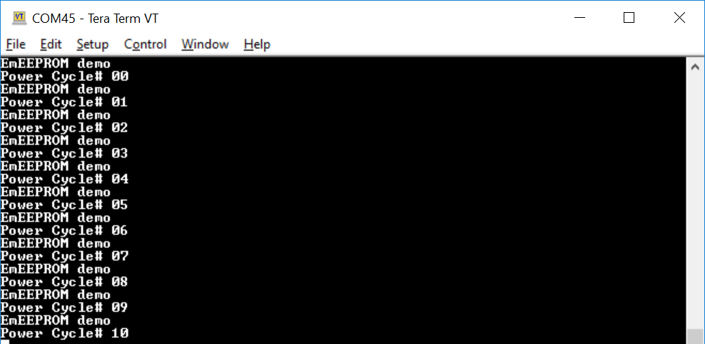

# PSoC 6 MCU: Emulated EEPROM

This example uses the Arm® Cortex®-M4 (CM4) CPU of PSoC™ 6 MCU to execute two tasks: UART communication and emulate EEPROM behavior in flash memory. At device reset, the default Cortex-M0+ (CM0+) application enables the CM4 CPU and configures the CM0+ CPU to go to sleep. In this example, a counter is read from the emulated EEPROM (Em_EEPROM), incremented, written back to Em_EEPROM, and printed over the UART. This occurs at every device reset or power cycle. As a result, the UART prints out an incrementing value at every reset.

[Provide feedback on this Code Example.](https://cypress.co1.qualtrics.com/jfe/form/SV_1NTns53sK2yiljn?Q_EED=eyJVbmlxdWUgRG9jIElkIjoiQ0UxOTUzMTMiLCJTcGVjIE51bWJlciI6IjAwMS05NTMxMyIsIkRvYyBUaXRsZSI6IlBTb0MgNiBNQ1U6IEVtdWxhdGVkIEVFUFJPTSIsInJpZCI6InNia3IiLCJEb2MgdmVyc2lvbiI6IjIuMC4wIiwiRG9jIExhbmd1YWdlIjoiRW5nbGlzaCIsIkRvYyBEaXZpc2lvbiI6Ik1DRCIsIkRvYyBCVSI6IklDVyIsIkRvYyBGYW1pbHkiOiJQU09DIn0=)

## Requirements

- [ModusToolbox™ software](https://www.cypress.com/products/modustoolbox-software-environment) v2.2

    **Note:** This code example version requires ModusToolbox software version 2.2 or later and is not backward compatible with v2.1 or older versions. If you cannot move to ModusToolbox v2.2, use the latest compatible version of this example: [latest-v1.X](https://github.com/cypresssemiconductorco/mtb-example-psoc6-emulated-eeprom/tree/latest-v1.X).

- Board Support Package (BSP) minimum required version: 2.0.0
- Programming Language: C
- Associated Parts: All [PSoC™ 6 MCU](http://www.cypress.com/PSoC6) parts

## Supported Toolchains (make variable 'TOOLCHAIN')

- GNU Arm® Embedded Compiler v9.3.1 (`GCC_ARM`) - Default value of `TOOLCHAIN`
- Arm compiler v6.13 (`ARM`)
- IAR C/C++ compiler v8.42.2 (`IAR`)

## Supported Kits (make variable 'TARGET')

- [PSoC 6 Wi-Fi BT Prototyping Kit](https://www.cypress.com/CY8CPROTO-062-4343W) (`CY8CPROTO-062-4343W`) - Default value of `TARGET`
- [PSoC 6 WiFi-BT Pioneer Kit](https://www.cypress.com/CY8CKIT-062-WiFi-BT) (`CY8CKIT-062-WIFI-BT`)
- [PSoC 6 BLE Pioneer Kit](https://www.cypress.com/CY8CKIT-062-BLE) (`CY8CKIT-062-BLE`)
- [PSoC 6 BLE Prototyping Kit](https://www.cypress.com/CY8CPROTO-063-BLE) (`CY8CPROTO-063-BLE`)
- [PSoC 62S2 Wi-Fi BT Pioneer Kit](https://www.cypress.com/CY8CKIT-062S2-43012) (`CY8CKIT-062S2-43012`)
- [PSoC 62S1 Wi-Fi BT Pioneer Kit](https://www.cypress.com/CYW9P62S1-43438EVB-01) (`CYW9P62S1-43438EVB-01`)
- [PSoC 62S1 Wi-Fi BT Pioneer Kit](https://www.cypress.com/CYW9P62S1-43012EVB-01) (`CYW9P62S1-43012EVB-01`)
- [PSoC 62S3 Wi-Fi BT Prototyping Kit](https://www.cypress.com/CY8CPROTO-062S3-4343W) (`CY8CPROTO-062S3-4343W`)
- [PSoC 64 'Secure Boot' Wi-Fi BT Pioneer Kit](http://www.cypress.com/CY8CKIT-064B0S2-4343W) (`CY8CKIT-064B0S2-4343W`)

## Hardware Setup

This example uses the board's default configuration. See the kit user guide to ensure that the board is configured correctly.

**Note:** The PSoC 6 BLE Pioneer Kit (CY8CKIT-062-BLE) and the PSoC 6 WiFi-BT Pioneer Kit (CY8CKIT-062-WIFI-BT) ship with KitProg2 installed. The ModusToolbox software requires KitProg3. Before using this code example, make sure that the board is upgraded to KitProg3. The tool and instructions are available in the [Firmware Loader](https://github.com/cypresssemiconductorco/Firmware-loader) GitHub repository. If you do not upgrade, you will see an error like "unable to find CMSIS-DAP device" or "KitProg firmware is out of date".

## Software Setup

Install a terminal emulator if you don't have one. Instructions in this document use [Tera Term](https://ttssh2.osdn.jp/index.html.en).

This example requires no additional software or tools.

## Using the Code Example

Create the project and open it using one of the following:

<details><summary><b>In Eclipse IDE for ModusToolbox</b></summary>

1. Click the **New Application** link in the **Quick Panel** (or, use **File** > **New** > **ModusToolbox Application**). This launches the [Project Creator](http://www.cypress.com/ModusToolboxProjectCreator) tool.

2. Pick a kit supported by the code example from the list shown in the **Project Creator - Choose Board Support Package (BSP)** dialog.

   When you select a supported kit, the example is reconfigured automatically to work with the kit. To work with a different supported kit later, use the [Library Manager](https://www.cypress.com/ModusToolboxLibraryManager) to choose the BSP for the supported kit. You can use the Library Manager to select or update the BSP and firmware libraries used in this application. To access the Library Manager, click the link from the **Quick Panel**.

   You can also just start the application creation process again and select a different kit.

   If you want to use the application for a kit not listed here, you may need to update the source files. If the kit does not have the required resources, the application may not work.

3. In the **Project Creator - Select Application** dialog, choose the example by enabling the checkbox.

4. Optionally, change the suggested **New Application Name**.

5. Enter the local path in the **Application(s) Root Path** field to indicate where the application needs to be created.

   Applications that can share libraries can be placed in the same root path.

6. Click **Create** to complete the application creation process.

For more details, see the [Eclipse IDE for ModusToolbox User Guide](https://www.cypress.com/MTBEclipseIDEUserGuide) (locally available at *{ModusToolbox install directory}/ide_{version}/docs/mt_ide_user_guide.pdf*).

</details>

<details><summary><b>In Command-line Interface (CLI)</b></summary>

ModusToolbox provides the Project Creator as both a GUI tool and a command line tool to easily create one or more ModusToolbox applications. See the "Project Creator Tools" section of the [ModusToolbox User Guide](https://www.cypress.com/ModusToolboxUserGuide) for more details.

Alternatively, you can manually create the application using the following steps:

1. Download and unzip this repository onto your local machine, or clone the repository.

2. Open a CLI terminal and navigate to the application folder.

   On Linux and macOS, you can use any terminal application. On Windows, open the **modus-shell** app from the Start menu.

   **Note:** The cloned application contains a default BSP file (*TARGET_xxx.mtb*) in the *deps* folder. Use the [Library Manager](https://www.cypress.com/ModusToolboxLibraryManager) (`make modlibs` command) to select and download a different BSP file, if required. If the selected kit does not have the required resources or is not [supported](#supported-kits-make-variable-target), the application may not work.

3. Import the required libraries by executing the `make getlibs` command.

Various CLI tools include a `-h` option that prints help information to the terminal screen about that tool. For more details, see the [ModusToolbox User Guide](https://www.cypress.com/ModusToolboxUserGuide) (locally available at *{ModusToolbox install directory}/docs_{version}/mtb_user_guide.pdf*).

</details>

<details><summary><b>In Third-party IDEs</b></summary>

1. Follow the instructions from the **In Command-line Interface (CLI)** section to create the application, and import the libraries using the `make getlibs` command.

2. Export the application to a supported IDE using the `make <ide>` command.

   For a list of supported IDEs and more details, see the "Exporting to IDEs" section of the [ModusToolbox User Guide](https://www.cypress.com/ModusToolboxUserGuide) (locally available at *{ModusToolbox install directory}/docs_{version}/mtb_user_guide.pdf*.

3. Follow the instructions displayed in the terminal to create or import the application as an IDE project.

</details>

## Operation

If using a PSoC 64 'Secure' MCU kit (like CY8CKIT-064B0S2-4343W), the PSoC 64 MCU must be provisioned with keys and policies before being programmed. Follow the instructions in the ['Secure Boot' SDK User Guide](https://www.cypress.com/documentation/software-and-drivers/psoc-64-secure-mcu-secure-boot-sdk-user-guide) to provision the device. If the kit is already provisioned, copy-paste the keys and policy folder to the application folder.

In this example, EEPROM storage can be declared in either the application flash (user flash) or in the section of the flash dedicated for Em_EEPROM. The example uses the dedicated Em_EEPROM region of the flash for emulation by default. If you are using the user flash area for EEPROM emulation for PSoC 64 MCU, see the [Placing the EEPROM Array in User Flash for CY8CKIT-064B0S2-4343W](#placing-the-eeprom-array-in-user-flash-for-cy8ckit-064b0s2-4343w) section before programming.

1. Connect the board to your PC using the provided USB cable through the KitProg3 USB connector.

2. Open a terminal program and select the KitProg3 COM port. Set the serial port parameters to 8N1 and 115200 baud.

3. Program the board using one of the following:

   <details><summary><b>Using Eclipse IDE for ModusToolbox</b></summary>

      1. Select the application project in the Project Explorer.

      2. In the **Quick Panel**, scroll down, and click **\<Application Name> Program (KitProg3_MiniProg4)**.
      </details>

   <details><summary><b>Using CLI</b></summary>

     From the terminal, execute the `make program` command to build and program the application using the default toolchain to the default target. You can specify a target and toolchain manually:
      ```
      make program TARGET=<BSP> TOOLCHAIN=<toolchain>
      ```

      Example:
      ```
      make program TARGET=CY8CPROTO-062-4343W TOOLCHAIN=GCC_ARM
      ```
</details>

4. After programming the device, observe the counter value in the serial terminal. The value increments each time you reset or cycle power. The figure below shows a sample output.

**Figure 1. Sample Output Showing Incremental Counter Value**



## Debugging

You can debug the example to step through the code. In the IDE, use the **\<Application Name> Debug (KitProg3_MiniProg4)** configuration in the **Quick Panel**. For more details, see the "Program and Debug" section in the [Eclipse IDE for ModusToolbox User Guide](https://www.cypress.com/MTBEclipseIDEUserGuide).

**Note:** **(Only while debugging)** On the CM4 CPU, some code in `main()` may execute before the debugger halts at the beginning of `main()`. This means that some code executes twice - once before the debugger stops execution, and again after the debugger resets the program counter to the beginning of `main()`. See [KBA231071](https://community.cypress.com/docs/DOC-21143) to learn about this and for the workaround.

## Design and Implementation

This example demonstrates how to use Em_EEPROM middleware. The application also uses a Serial Communication Block (SCB) resource, configured as UART.

On startup, the example initializes the SCB and the Em_EEPROM block in flash. Then, a read operation is performed to verify whether the data stored in EEPROM is valid. If valid, the counter is incremented by one and the new value of the counter is written back to the Em_EEPROM. Otherwise, the expected valid data is written to the Em_EEPROM. The firmware then reads the value in the Em_EEPROM and prints it to a terminal window via UART. Every time the device is reset or power is cycled, the counter is incremented and printed on serial terminal.

The firmware includes the declaration of EEPROM storage and details of the EEPROM configuration and context structures. In this example, EEPROM storage can be declared in either the application flash (user flash) or in the section of the flash dedicated for Em_EEPROM. If the data is written to the user flash, a blocking write must be used. This is because a write to and read/execute from the same flash sector at the same time while using non-blocking writes may cause a HardFault exception. Either blocking or non-blocking write will work for the Em_EEPROM flash, because it is in a different flash sector. For more details, see [Flash System Routine (Flash)](https://cypresssemiconductorco.github.io/mtb-pdl-cat1/pdl_api_reference_manual/html/group__group__flash.html) section in PDL documentation.

The example can choose either user flash or dedicated EEPROM area in the flash for EEPROM emulation. Set the `FLASH_REGION_TO_USE` macro as `USER_FLASH` or `EMULATED_EEPROM_FLASH` to store in the user flash or EEPROM area respectively. The example uses the dedicated EEPROM area of the flash for EEPROM emulation by default.

See the [API Reference Quick Start Guide](https://cypresssemiconductorco.github.io/emeeprom/em_eeprom_api_reference_manual/html/index.html#section_em_eeprom_quick_start) section for step-by-step instruction on how to enable the Emulated EEPROM Middleware Library.

### Placing the EEPROM Array in User Flash for CY8CKIT-064B0S2-4343W

In the case of CY8CKIT-064B0S2-4343W, post-build steps are executed which perform signing of the image as dictated by the policies provided by the user. Because the counter value in the EEPROM is incremented at every reset/power-cycle, a signature mismatch would occur if the EEPROM is within the image area (user flash area) that gets signed.

Therefore, in order to prevent a signature mismatch, this example is configured to emulate the EEPROM at a fixed location outside the image area in the user flash as specified by the `APP_DEFINED_EM_EEPROM_LOCATION_IN_FLASH` macro. The EEPROM is placed at the end of the image area. This requires the size of the CM4 image to be modified in the policy.

To do this, open the default policy, *policy/policy_single_CM0_CM4*, in an editor and go to the CM4 application image boot and upgrade policy. For CM4 application image, the JSON field `id` is set as 16. Next, in the resources section, change the value of the size such that `address + size = APP_DEFINED_EM_EEPROM_LOCATION_IN_FLASH`. 

**Note:** Refer to the <BSP>.mk (e.g. CY8CKIT-064B0S2-4343W.mk) file in the BSP to know  the default policy name. The Make variable `CY_SECURE_POLICY_NAME` denotes the default policy name. Please note that the default policy must be *policy/policy_single_CM0_CM4* while using cysecuretools version 2.0.0 and it must be *policy/policy_single_CM0_CM4_swap* while using cysecuretools version 3.0.0. You can find the version of the tool by entering `cysecuretools version` in **modus-shell**. ModusToolbox 2.2 bundles cysecuretools version 2.0.0 in the installation package. You can install cysecuretools version 3.0.0 by running the following command in **modus-shell**.

   `python -m pip install --upgrade --force-reinstall cysecuretools`


### Resources and Settings

**Table 1. Application Resources**

| Resource  |  Alias/Object     |    Purpose     |
| :------- | :------------    | :------------ |
| UART (HAL) |cy_retarget_io_uart_obj| UART HAL object used by Retarget-IO for Debug UART port |
| GPIO (HAL)    | CYBSP_USER_LED         |  User LED to show visual indication of an error                  |

## Related Resources

| Application Notes                                            |                                                              |
| :----------------------------------------------------------- | :----------------------------------------------------------- |
| [AN228571](https://www.cypress.com/AN228571) – Getting Started with PSoC 6 MCU on ModusToolbox | Describes PSoC 6 MCU devices and how to build your first application with ModusToolbox |
| [AN221774](https://www.cypress.com/AN221774) – Getting Started with PSoC 6 MCU on PSoC Creator | Describes PSoC 6 MCU devices and how to build your first application with PSoC Creator |
| [AN210781](https://www.cypress.com/AN210781) – Getting Started with PSoC 6 MCU with Bluetooth Low Energy (BLE) Connectivity on PSoC Creator | Describes PSoC 6 MCU with BLE Connectivity devices and how to build your first application with PSoC Creator |
| [AN215656](https://www.cypress.com/AN215656) – PSoC 6 MCU: Dual-CPU System Design | Describes the dual-CPU architecture in PSoC 6 MCU, and shows how to build a simple dual-CPU design |
| **Code Examples**                                            |                                                              |
| [Using ModusToolbox](https://github.com/cypresssemiconductorco/Code-Examples-for-ModusToolbox-Software) | [Using PSoC Creator](https://www.cypress.com/documentation/code-examples/psoc-6-mcu-code-examples) |
| **Device Documentation**                                     |                                                              |
| [PSoC 6 MCU Datasheets](https://www.cypress.com/search/all?f[0]=meta_type%3Atechnical_documents&f[1]=resource_meta_type%3A575&f[2]=field_related_products%3A114026) | [PSoC 6 Technical Reference Manuals](https://www.cypress.com/search/all/PSoC%206%20Technical%20Reference%20Manual?f[0]=meta_type%3Atechnical_documents&f[1]=resource_meta_type%3A583) |
| **Development Kits**                                         | Buy at www.cypress.com                                       |
| [CY8CKIT-062-BLE](https://www.cypress.com/CY8CKIT-062-BLE) PSoC 6 BLE Pioneer Kit | [CY8CKIT-062-WiFi-BT](https://www.cypress.com/CY8CKIT-062-WiFi-BT) PSoC 6 WiFi-BT Pioneer Kit |
| [CY8CPROTO-063-BLE](https://www.cypress.com/CY8CPROTO-063-BLE) PSoC 6 BLE Prototyping Kit | [CY8CPROTO-062-4343W](https://www.cypress.com/CY8CPROTO-062-4343W) PSoC 6 Wi-Fi BT Prototyping Kit |
| [CY8CKIT-062S2-43012](https://www.cypress.com/CY8CKIT-062S2-43012) PSoC 62S2 Wi-Fi BT Pioneer Kit | [CY8CPROTO-062S3-4343W](https://www.cypress.com/CY8CPROTO-062S3-4343W) PSoC 62S3 Wi-Fi BT Prototyping Kit |
| [CYW9P62S1-43438EVB-01](https://www.cypress.com/CYW9P62S1-43438EVB-01) PSoC 62S1 Wi-Fi BT Pioneer Kit | [CYW9P62S1-43012EVB-01](https://www.cypress.com/CYW9P62S1-43012EVB-01) PSoC 62S1 Wi-Fi BT Pioneer Kit |
| [CY8CKIT-064B0S2-4343W](http://www.cypress.com/CY8CKIT-064B0S2-4343W) PSoC 64 'Secure Boot' Wi-Fi BT Pioneer Kit |
| **Libraries**                                                |                                                              |
| PSoC 6 Peripheral Driver Library (PDL) and docs  | [mtb-pdl-cat1](https://github.com/cypresssemiconductorco/mtb-pdl-cat1) on GitHub |
| Cypress Hardware Abstraction Layer (HAL) Library and docs    | [mtb-hal-cat1](https://github.com/cypresssemiconductorco/mtb-hal-cat1) on GitHub |
| Retarget IO - A utility library to retarget the standard input/output (STDIO) messages to a UART port | [retarget-io](https://github.com/cypresssemiconductorco/retarget-io) on GitHub |
| **Middleware**                                               |                                                              |
| Emulated EEPROM middleware                                   | [emeeprom](https://github.com/cypresssemiconductorco/emeeprom) |
| CapSense® library and docs                                    | [capsense](https://github.com/cypresssemiconductorco/capsense) on GitHub |
| Links to all PSoC 6 MCU Middleware                           | [psoc6-middleware](https://github.com/cypresssemiconductorco/psoc6-middleware) on GitHub |
| **Tools**                                                    |                                                              |
| [Eclipse IDE for ModusToolbox](https://www.cypress.com/modustoolbox) | The cross-platform, Eclipse-based IDE for IoT designers that supports application configuration and development targeting converged MCU and wireless systems. |
| [PSoC Creator™](https://www.cypress.com/products/psoc-creator-integrated-design-environment-ide) | The Cypress IDE for PSoC and FM0+ MCU development. |

### Other Resources

Cypress provides a wealth of data at www.cypress.com to help you select the right device, and quickly and effectively integrate it into your design.

For PSoC 6 MCU devices, see [How to Design with PSoC 6 MCU - KBA223067](https://community.cypress.com/docs/DOC-14644) in the Cypress community.

## Document History

Document Title: *CE195313* - *PSoC 6 MCU: Emulated EEPROM*

| Revision | Description of Change                                        |
| -------- | ------------------------------------------------------------ |
| v1.0.0   | New code example.                                             |
| v1.1.0   | Updated to support ModusToolbox software v2.1                |
| 2.0.0   | Major update to support ModusToolbox software v2.2.<br /> This version is not backward compatible with ModusToolbox software v2.1.  |
------

All other trademarks or registered trademarks referenced herein are the property of their respective owners.


-------------------------------------------------------------------------------

© Cypress Semiconductor Corporation (An Infineon Technologies Company), 2019-2021. This document is the property of Cypress Semiconductor Corporation and its affiliates ("Cypress"). This document, including any software or firmware included or referenced in this document ("Software"), is owned by Cypress under the intellectual property laws and treaties of the United States and other countries worldwide. Cypress reserves all rights under such laws and treaties and does not, except as specifically stated in this paragraph, grant any license under its patents, copyrights, trademarks, or other intellectual property rights. If the Software is not accompanied by a license agreement and you do not otherwise have a written agreement with Cypress governing the use of the Software, then Cypress hereby grants you a personal, non-exclusive, nontransferable license (without the right to sublicense) (1) under its copyright rights in the Software (a) for Software provided in source code form, to modify and reproduce the Software solely for use with Cypress hardware products, only internally within your organization, and (b) to distribute the Software in binary code form externally to end users (either directly or indirectly through resellers and distributors), solely for use on Cypress hardware product units, and (2) under those claims of Cypress's patents that are infringed by the Software (as provided by Cypress, unmodified) to make, use, distribute, and import the Software solely for use with Cypress hardware products. Any other use, reproduction, modification, translation, or compilation of the Software is prohibited.<br />
TO THE EXTENT PERMITTED BY APPLICABLE LAW, CYPRESS MAKES NO WARRANTY OF ANY KIND, EXPRESS OR IMPLIED, WITH REGARD TO THIS DOCUMENT OR ANY SOFTWARE OR ACCOMPANYING HARDWARE, INCLUDING, BUT NOT LIMITED TO, THE IMPLIED WARRANTIES OF MERCHANTABILITY AND FITNESS FOR A PARTICULAR PURPOSE. No computing device can be absolutely secure. Therefore, despite security measures implemented in Cypress hardware or software products, Cypress shall have no liability arising out of any security breach, such as unauthorized access to or use of a Cypress product. CYPRESS DOES NOT REPRESENT, WARRANT, OR GUARANTEE THAT CYPRESS PRODUCTS, OR SYSTEMS CREATED USING CYPRESS PRODUCTS, WILL BE FREE FROM CORRUPTION, ATTACK, VIRUSES, INTERFERENCE, HACKING, DATA LOSS OR THEFT, OR OTHER SECURITY INTRUSION (collectively, "Security Breach"). Cypress disclaims any liability relating to any Security Breach, and you shall and hereby do release Cypress from any claim, damage, or other liability arising from any Security Breach. In addition, the products described in these materials may contain design defects or errors known as errata which may cause the product to deviate from published specifications. To the extent permitted by applicable law, Cypress reserves the right to make changes to this document without further notice. Cypress does not assume any liability arising out of the application or use of any product or circuit described in this document. Any information provided in this document, including any sample design information or programming code, is provided only for reference purposes. It is the responsibility of the user of this document to properly design, program, and test the functionality and safety of any application made of this information and any resulting product. "High-Risk Device" means any device or system whose failure could cause personal injury, death, or property damage. Examples of High-Risk Devices are weapons, nuclear installations, surgical implants, and other medical devices. "Critical Component" means any component of a High-Risk Device whose failure to perform can be reasonably expected to cause, directly or indirectly, the failure of the High-Risk Device, or to affect its safety or effectiveness. Cypress is not liable, in whole or in part, and you shall and hereby do release Cypress from any claim, damage, or other liability arising from any use of a Cypress product as a Critical Component in a High-Risk Device. You shall indemnify and hold Cypress, its directors, officers, employees, agents, affiliates, distributors, and assigns harmless from and against all claims, costs, damages, and expenses, arising out of any claim, including claims for product liability, personal injury or death, or property damage arising from any use of a Cypress product as a Critical Component in a High-Risk Device. Cypress products are not intended or authorized for use as a Critical Component in any High-Risk Device except to the limited extent that (i) Cypress's published data sheet for the product explicitly states Cypress has qualified the product for use in a specific High-Risk Device, or (ii) Cypress has given you advance written authorization to use the product as a Critical Component in the specific High-Risk Device and you have signed a separate indemnification agreement.<br />
Cypress, the Cypress logo, Spansion, the Spansion logo, and combinations thereof, WICED, PSoC, CapSense, EZ-USB, F-RAM, and Traveo are trademarks or registered trademarks of Cypress in the United States and other countries. For a more complete list of Cypress trademarks, visit cypress.com. Other names and brands may be claimed as property of their respective owners.
t